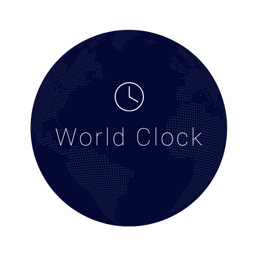
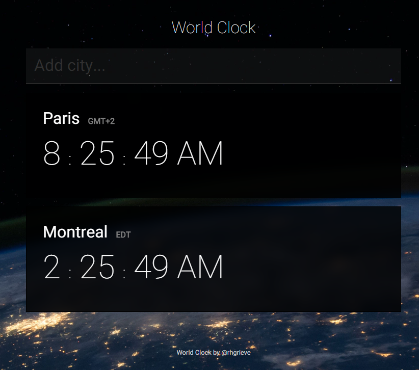

<h1 align="center">
   

   
  react-world-clock
   
</h1>

<h4 align="center">A simple world clock built with React, Airtable and Cloudflare Workers</h4>

  <a href="#key-features">Key Features</a> •
  <a href="#credits">Credits</a> •
  <a href="#license">License</a>

## Key Features

* Global cities from [GeoNames.org](http://www.geonames.org/) geographical database
* Uses local storage to save your clock configuration

## Credits

Built using:

* [CodeSandbox](https://codesandbox.io/)
* [React](https://github.com/facebook/react)
* [Airtable](https://airtable.com/)
* [portable-cto/airtable-proxy-worker](https://github.com/portable-cto/airtable-proxy-worker)

Hosted on [Vercel](https://vercel.com)

## License

MIT
